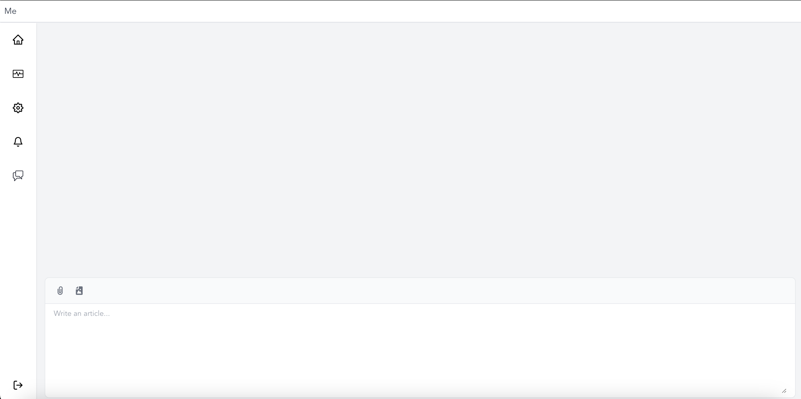

client
--
Decentralized chat client, including the client's main implementation and cli.


### Installation of dependencies
```bash
npm install -g tailwindcss
rustup target add wasm32-unknown-unknown
cargo install wasm-bindgen-cli tauri-cli trunk
```

### Run
```bash
trunk serve 
```



